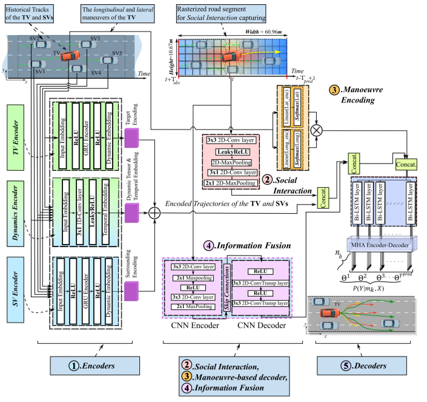

# IEG Motion Predictions with Deep Multi-Agent Learning


This project is focused on developing a data-driven prediction framework for highly automated vehicles (AVs), leveraging multiple inputs to provide a multimodal, probabilistic estimate of the future intentions and trajectories of surrounding vehicles in freeway operations. Our proposed framework utilises deep multi-agent learning to effectively capture social interactions between vehicles, without relying on map information. Please refer to our recent [publication](https://doi.org/10.1109/TITS.2023.3339640) for more details. This algorithm has demonstrated superior prediction performance, with reduced error in real-world traffic data from highways. Evaluation using the NGSIM (US-101 and I-80) and HighD datasets indicates strong prediction performance for long-term trajectory forecasting of multiple surrounding vehicles. Furthermore, the framework exhibits enhanced prediction accuracy and generalisability compared to state-of-the-art methods.

[Djamel Eddine Benrachou](https://scholar.google.com/citations?user=0lHe7ycAAAAJ&hl=en)

[Centre for Accident Research & Road Safety - Queensland, QUT](https://research.qut.edu.au/carrsq/staff/djamel-benrachou/)

------------------

**News 🚀🚀**
- [12/2023] Work on Transactions on Intelligent Transportation Systems (T-ITS, Q1-JCR):
  "Improving Efficiency and Generalisability of Motion Predictions With Deep Multi-Agent Learning and Multi-Head Attention"
- [09/2022] Work on Transactions on Intelligent Transportation Systems (T-ITS, Q1-JCR):
  "Use of Social Interaction and Intention to Improve Motion Prediction Within Automated Vehicle Framework: A Review"

------------------

This is the official repository and [PyTorch](https://pytorch.org/) implementations of different works presented in:

Our papers:
- [Improving Efficiency and Generalisability of Motion Predictions with Multi-Agent Learning and Multi-Head Attention](https://ieeexplore.ieee.org/abstract/document/10368189/) in IEEE Transactions on Intelligent Transportation Systems
- [Use of Social Interaction and Intention to Improve Motion Prediction Within Automated Vehicle Framework: A Review](https://ieeexplore.ieee.org/abstract/document/9904961) in IEEE Transactions on Intelligent Transportation Systems

# Algorithm:



# Setup:
The code can be executed in a Conda environment—please follow the tutorial below:

```bash
conda create -n MyEnvi python=3.7
source activate MyEnvi

conda install pytorch==1.12.0 torchvision==0.4.0 cudatoolkit=10.0 -c pytorch
conda install tensorboard=1.14.0
conda install numpy=1.16 scipy=1.4 h5py=2.10 future
```
The code can also be written in the following environment:
```
python 3.7.11
pytorch 1.10.0
cuda 11.3 or above
cudnn 8.2.0
```
If available, check `requirements.txt`

```
conda create --name GATLSTM_env python=3.7 \
conda install -n GATLSTM_env ipykernel --update-deps --force-reinstall
```
```
python3 -m pip install --upgrade pip \
python3 -m pip install --upgrade Pillow \
```
```
pip install \
    prodict \
    torch \
    pyyaml \
    torchvision \
    tensorboard \
    glob2 \
    matplotlib \
    sklearn \
    gitpython \
    thop \
    fvcore \
    torchstat \
    torchsummary \
    ipykernel \
    sns
```

# Datasets

## NGSIM
  
From NGSIM website:  
* Register at [NGSIM](https://data.transportation.gov/Automobiles/Next-Generation-Simulation-NGSIM-Vehicle-Trajector/8ect-6jqj)  
* Download [NGSIM-US-101-LosAngeles-CA]US-101-LosAngeles-CA.zip and [NGSIM-I-80-Emeryville-CA] I-80-Emeryville-CA.zip  
* Unzip and extract vehicle-trajectory-data into raw/us-101 and ./raw/i-80  
  
From googledrive:  
* Download i-80: https://drive.google.com/open?id=19ovxiJLCnS1ar1dYvUIrfdz_UnGejK-k  
* Download us-101: https://drive.google.com/open?id=14dMKew22_5evfOoSGEBYqHP3L92e7nyJ  

Dataset fields:  
* doc/trajectory-data-dictionary.htm  

This Dataset is to be pre-processed with the Matlab function preprocess_data.m (that is a slightly modified version of the one from https://github.com/nachiket92/conv-social-pooling)

* Already preprocessed samples: (to run tests on Hybrid-Models)
    * https://drive.google.com/open?id=171YZvK2DnJbtIgve6qAOkk6AFNrGAYTJ
    * https://drive.google.com/open?id=1N080iiQc43MTvLMqaLtsZh49okJL0hPx
    
Dataset fields:  
* doc/trajectory-data-dictionary.htm  

## HighD 
   * [https://www.highd.com/](https://www.highd-dataset.com/)

## Pre-processed NGSIM and HighD can be downloaded from [here](https://connectqutedu-my.sharepoint.com/:u:/r/personal/n10439251_qut_edu_au/Documents/processed_data/OneDrive_1_4-20-2023.zip?csf=1&web=1&e=uRNYbS)

Data Preparation:
The raw data of Next Generation Simulation (NGSIM) is downloadable at https://ops.fhwa.dot.gov/trafficanalysistools/ngsim.htm

1. Download the data:      Once the data downloaded the raw data into ```./raw```
2. Preprocess the data : Run 
```
preprocess_data.m to pre-preprocess the raw data (note: the pre-processed data will be uploaded on cloud).
```
This repository is for testing the trained models for motion prediction on highways. No end-to-end trainer is needed here.
3.To use the pretrained models at ./ .py and evaluate the models performance run! 🎉 🎉
```
python3 evaluate.py --name ngsim_model --batch_size 64 \
    --test_set ./datasets/NGSIM/test.mat 
```   

Trained models can be downloaded [here](https://connectqutedu-my.sharepoint.com/)


  
 
# Citation

Please cite our papers if you used our code. Thanks.
```
@article{benrachou2022use,
  title={Use of social interaction and intention to improve motion prediction within automated vehicle framework: A review},
  author={Benrachou, Djamel Eddine and Glaser, Sebastien and Elhenawy, Mohammed and Rakotonirainy, Andry},
  journal={IEEE Transactions on Intelligent Transportation Systems},
  year={2022},
  publisher={IEEE}
}

@article{benrachou2023improving,
  title={Improving Efficiency and Generalisability of Motion Predictions With Deep Multi-Agent Learning and Multi-Head Attention},
  author={Benrachou, Djamel Eddine and Glaser, Sebastien and Elhenawy, Mohammed and Rakotonirainy, Andry},
  journal={IEEE Transactions on Intelligent Transportation Systems},
  year={2023},
  publisher={IEEE}
}
```


 # License

 [LICENSE](https://creativecommons.org/licenses/by-nc/4.0/)
